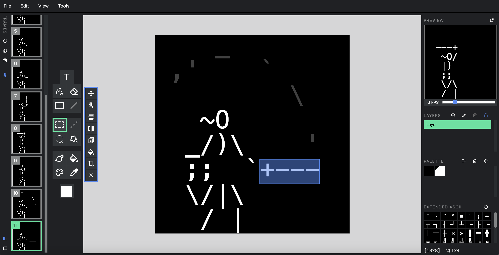

# ascii-reel
A tool to help create ASCII animations!



**Result:**


Note: This tool does **not** convert images to ASCII; it is 
designed to aid manually drawing ASCII animations.


## Why make ASCII art?

- It's fun and easy (at least, once you get the hang of it!)
- Are you making a 2D game and suck at pixel art? Make the art out of ASCII instead!

## Why use this tool?

- Creating ASCII in a normal text editor can be annoying
  - If you want to draw something on the right side, you have to add spaces/tabs to get there first
  - It's hard to move text around without it shifting everything
  - When exporting the final art to something like JSON, you have to 
  convert all the rows to strings, escape all the `\` and `"` characters, etc.
- When making animations, it gets even harder to keep track of all the frames.
- This tool has many quality of life improvements over a text editor, such as:
  - An onion tool to see what the previous frame was
  - ASCII rectangle/line drawing helpers - draw a line of characters with the click of a mouse!
  - Layering: For complex animations, where a background is static but the foreground
    is moving. 
  - Coloring: This tool supports coloring individual characters
  - Continuously preview the animation while you're working on it

## Dev

### Running the app locally:

After cloning the repo:
```
npm install
```

To run the app:
```
npm run dev
```

App is now available at https://localhost:8080

### Directory structure

- `/patches`
    - Used by [patch-package](https://www.npmjs.com/package/patch-package)
    - I needed to make [a fix](https://github.com/robkiessling/gif-transparency/commit/01ddf34509631a1c733483f063f4e20e8ae036d2)
    to the [gif-transparency](https://www.npmjs.com/package/gif-transparency) package. 
    Just using patch-package for now so I don't have to put the fix in npm. 
    - If gif export is failing, make sure the patch has been loaded `npm run postinstall`